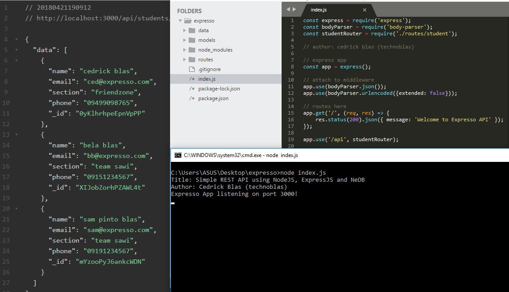

# expresso
Simple REST API using NodeJS, ExpressJS, and NeDB (MongoDB lite)

### Getting Started
These instructions will get you a copy of the project up and running on your local machine for development and testing purposes.

### Installation (dependencies)
This is a Node.js module available through the npm registry.

Before installing, download and install [Node.js.](https://nodejs.org/)

Installation is done using the npm install command:
```
npm install
```
### Start the server
```
node index.js
```


